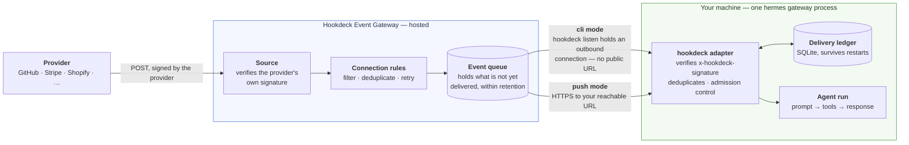
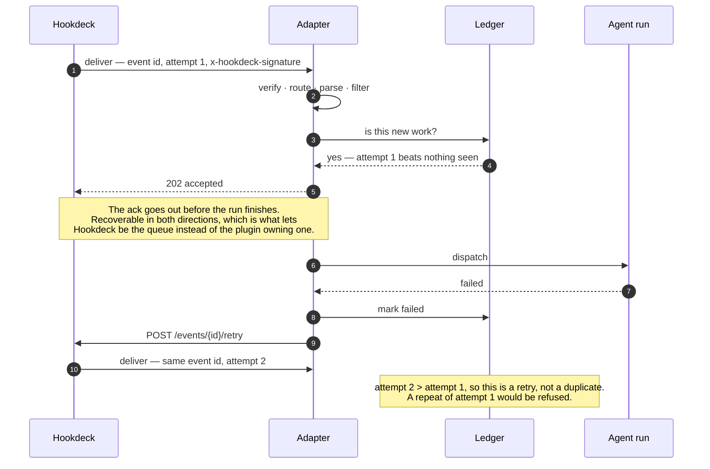

# hermes-hookdeck

A [Hookdeck Event Gateway](https://hookdeck.com/docs) plugin for
[Hermes Agent](https://github.com/NousResearch/hermes-agent). It puts a durable,
verified queue in front of the agent, so a webhook can trigger an agent run
without the usual ways that goes wrong.

If you have not met both halves: **Hermes Agent** is a self-hosted AI agent from
Nous Research that runs as a long-lived gateway process — on a laptop, a $5 VPS,
wherever — and takes work from Telegram, Discord, Slack, a terminal, a cron
schedule, or a webhook. **Hookdeck Event Gateway** is a hosted service that sits
between a webhook provider and you: it verifies the provider's signature, queues
each event, applies filters and retries, and holds everything it has not yet
delivered so you can inspect or replay it. This plugin makes Hookdeck the front
door for Hermes' webhook trigger — so a GitHub pull request, a Stripe payment or
a Shopify order becomes an agent run that is verified once, runs once, and is
not silently lost when the run fails or the machine restarts.

Two names worth pinning down, because both are overloaded:

- **Event Gateway, not the rest of Hookdeck.** Hookdeck's platform also includes
  [Outpost](https://hookdeck.com/docs/outpost), which is the other direction —
  self-hosted infrastructure for sending *your* webhooks to *your* users. This
  plugin is inbound only: third-party events arriving at your agent. Nothing
  here helps Hermes publish webhooks, and it does not talk to Outpost.
- **"Platform" is Hermes' word, not Hookdeck's.** In Hermes a *platform* is a
  source of inbound work — Telegram is a platform, Slack is a platform — and
  this plugin registers a new one called `hookdeck`, alongside the built-in
  `webhook`. It is unrelated to the Hookdeck platform in the marketing sense.

Hermes already has a good webhook trigger: a POST arrives, a route matches, a
prompt template renders, the agent runs, the response gets delivered. This
plugin keeps all of that and replaces the ingest half, because an agent run is
an awkward thing to hang off a webhook. It takes seconds to minutes, it costs
money every time it happens, and it should not happen twice for the same event.

## What changes

| | Built-in `webhook` platform | With `hookdeck` |
|---|---|---|
| Signature verification | GitHub, GitLab, generic HMAC | ~140 provider schemes verified by Hookdeck at the edge; the adapter verifies one |
| Ingress | Public HTTP listener | Hookdeck CLI (no public URL) or HTTP push |
| Gateway offline | POST is lost | Pause the connection and events are held at `HOLD`, then drain on resume (see the CLI caveat below) |
| Burst | 30/min per route, excess dropped | Queued and throttled; over the limit gets 503 + `Retry-After` |
| Duplicate delivery | In-memory 1h cache, lost on restart | SQLite ledger keyed on the Hookdeck event id |
| Run fails | 202 was already sent; the event is gone | Handed back to Hookdeck for redelivery |
| Gateway dies mid-run | Silently lost | Orphaned runs found in the ledger at boot and redelivered |
| Replay | — | Per-event and bulk replay, from the CLI or by the agent itself |

The last two rows are the ones that matter most. The built-in adapter answers
202 as soon as it dispatches, which is the right thing to do — but it means a
failed run has already been acknowledged, and nothing remembers it happened.

## How it fits together



Two signatures, two different jobs. Hookdeck checks the *provider's* signature
at the edge — Stripe's, Shopify's, Twilio's, ~140 schemes — and then signs its
own delivery. The adapter checks only that one, which is the whole point of the
integration: Hermes implements one verifier instead of one per provider.

### The delivery that has to come back

The diagram above is just the path in. What makes this more than a webhook
listener is the arrow it does not show — the adapter telling Hookdeck that a run
failed, so the event returns instead of being forgotten:



The attempt counter is what lets deduplication and retry coexist rather than
cancelling each other out. It is also how a gateway that dies at step 7 recovers:
the ledger row is still `running` at the next boot, which by then can only mean
the process that owned it is gone, so the adapter asks for the same redelivery
at step 9. That is [`ack_mode: async_retry`](#how-the-reliability-works), the
default; `sync` holds the response open instead and lets Hookdeck's own retry
rules do the work.

### Two ways in

Both modes run the same adapter and the same reliability machinery. They differ
only in how an event crosses your network boundary.

| | `mode: cli` (default) | `mode: push` |
|---|---|---|
| Reachability | None needed — the connection is outbound | A public HTTPS URL |
| Suits | A laptop, a homelab box, anything behind NAT | A VPS, a container, anything with an address |
| Extra process | One `hookdeck listen` per route | None |
| Gateway-side throttling | Not available — CLI destinations have no rate limit | Delivery rate limits, delivery groups, issue triggers, alerting |
| Buffering while you are down | Only if you **pause** first — see the caveat in the CLI quickstart | Yes; failed deliveries stay queued and retry |

In `cli` mode the listener binds loopback only and is not reachable from the
network at all. In `push` mode it binds whatever `host` you configure, and the
signature check is the only thing in front of it.

### Three things here are called "CLI"

Worth separating once, because the quickstarts use all three:

- **The Hookdeck CLI** (`hookdeck`) — a binary you install from Hookdeck, and
  the thing that makes `cli` mode work. You do not run it by hand: the adapter
  spawns `hookdeck listen` itself, one process per route, and supervises it —
  restarting with capped backoff if it dies, piping its output into the gateway
  log. What you do need is to be logged in (`hookdeck login`) and on version
  2.3.2 or later.
- **`hermes hookdeck …`** — the operator commands this plugin adds: `setup`,
  `status`, `pause`, `resume`, `replay`, `doctor`. These call the Hookdeck REST
  API rather than the binary above, and work in both modes.
- **`hermes`** — Hermes' own CLI, which hosts all of the above. `hermes gateway`
  runs the process the adapter lives in.

## Install

```bash
hermes plugins install hookdeck/hermes-hookdeck
```

Hermes clones it into `~/.hermes/plugins/`, prompts for the two secrets below,
and installs it disabled. Then:

```bash
hermes plugins enable hookdeck
```

<details>
<summary>Other ways in</summary>

**pip**, for a declarative or containerised setup — the package declares a
`hermes_agent.plugins` entry point, so Hermes discovers it wherever it is
installed, with no plugin directory involved:

```bash
pip install hermes-hookdeck && hermes plugins enable hookdeck
```

**Git clone**, if you want to hack on it — the plugin lives in a subdirectory,
which Hermes' category layout handles:

```bash
git clone https://github.com/hookdeck/hermes-hookdeck ~/.hermes/plugins/hermes-hookdeck
```
</details>

Set two secrets, both from your Hookdeck project settings:

```bash
export HOOKDECK_API_KEY=...        # Project Settings → Secrets
export HOOKDECK_WEBHOOK_SECRET=... # the signing secret
```

## Quickstart — CLI mode (no public URL)

The default. The Hookdeck CLI holds an outbound connection and forwards events
to a loopback listener, so a laptop or a homelab box behind NAT works without
ngrok or a VPS.

**A CLI destination is not a durable buffer.** With no listener attached,
events become `CLI_DISCONNECTED` ignored events and the request is discarded —
not queued, not retried. An *abnormal* disconnect gets a short server-side
grace window in which events are still created and fail as `CLI_UNAVAILABLE`,
which keeps them in the normal retry pipeline; a clean Ctrl+C forfeits even
that. So on a planned shutdown, **pause the connection before you stop the
gateway**:

```bash
hermes hookdeck pause github-prs
```

That is the durable path — paused events are held at `HOLD` and delivered on
resume. Never reach for `disable` instead: it cancels pending events
irrecoverably, as does deleting the connection.

The adapter does **not** run `hookdeck ci` to authenticate the CLI. That command
looks like a harmless idempotent login and is not: it rewrites the shared config
at `~/.config/hookdeck/config.toml`, swapping the stored key for a CLI session
key and switching the CLI's *active project*. Anyone using the CLI for other
work would find their environment repointed by starting a gateway. Log in
yourself with `hookdeck login`; set `cli_login: true` only if you accept that.

Use a CLI version of at least 2.3.2. Earlier ones stop delivering after a
listen session expires without saying so, which from the gateway's side looks
identical to "no events are arriving". `hermes hookdeck doctor` checks the
version *and* prints which binary it resolved — an npm global shadowing a
Homebrew install is common, and version-checking one binary while launching
another is worse than not checking. Set `cli_binary` to pin it explicitly.

Two behaviours worth recognising in the Hookdeck event log when the local
server is down. With no listen session attached at all, attempts record
`CLI_UNAVAILABLE` and no response status. With a session attached but the local
port refusing, the CLI reports a **500** upstream — which is one reason the
provisioned retry rule covers `500-599`: a gateway that has not finished
starting produces exactly this, and those events must come back.

Install the [Hookdeck CLI](https://hookdeck.com/docs/cli), add a route to
`~/.hermes/config.yaml` (see [`examples/config.yaml`](examples/config.yaml)),
then:

```bash
hermes hookdeck setup github-prs --source github --source-type GITHUB
```

That creates a source with GitHub's verification already configured, a CLI
destination, and a connection carrying exponential retries and a dedup window.

Start the gateway and the adapter launches `hookdeck listen` for you — one
process per route, since the CLI forwards a single source each, given
`--path /hookdeck/<route>` so the adapter resolves the route from the path.
Every route therefore needs a `source`, or a shared
`platforms.hookdeck.extra.source`.

Point GitHub at the source URL Hookdeck gives you and open a pull request.

`hookdeck listen` creates the source itself if it does not exist, so it will
work without `setup` — but you get a bare connection with none of the retry,
dedup or filter rules, which is most of the point.

## Quickstart — push mode

For a gateway with a reachable URL. Push mode unlocks the settings CLI
destinations do not support: delivery rate limits, delivery groups, issue
triggers and alerting.

Set `mode: push` and `public_url` in the config, then:

```bash
hermes hookdeck setup --all --mode push --rate-limit 2 --rate-limit-period concurrent
```

## How the reliability works

**One verifier.** Hookdeck verifies Stripe's signature, Shopify's HMAC,
Twilio's, and so on, then signs its own delivery with
`base64(HMAC-SHA256(body, secret))` in `x-hookdeck-signature`. The adapter
checks that one scheme, in constant time, before touching the payload.
`x-hookdeck-signature-2` is also accepted so a secret roll does not drop live
traffic.

**Dedup that survives a restart.** Every delivery carries an event id and an
attempt number. The ledger at `~/.hermes/hookdeck/state.db` admits a delivery
when its attempt number is higher than the highest already seen for that event,
and rejects it otherwise. Genuine duplicates repeat an attempt number; real
retries increment it — which is what lets dedup and retry coexist instead of
cancelling each other out.

**Backpressure instead of dropping.** `max_concurrent` caps agent runs in
flight. An event that arrives over the limit gets 503 and a `Retry-After`, so
Hookdeck keeps it queued and comes back. Nothing is recorded in the ledger for
a deferred event, so the redelivery is not mistaken for a duplicate. In push
mode you can push the same limit down into Hookdeck with `--rate-limit N
--rate-limit-period concurrent`. `--group-key` adds a *rate* limit per subject
(`--group-rate 1 --group-period minute`) — note that delivery groups accept
only `second|minute|hour`, so per-subject **concurrency** is not expressible;
`concurrent` works at destination level only.

**Outcomes reported, not assumed.** `ack_mode` decides how:

- `async_retry` (default) — ack 202 immediately, run the agent in the
  background, and call `POST /events/{id}/retry` if the run fails. Retry state
  lives in Hookdeck, so it survives a gateway restart. Stops after
  `max_agent_retries` and marks the event exhausted rather than looping.

  The same call covers the harder case. If the gateway dies mid-run, Hookdeck
  has already recorded that delivery as successful and will never redeliver it
  on its own — so at startup the adapter reads every ledger row still marked
  `running`, which by then can only be an orphan, and asks for redelivery.
  Between the two, an early ack is recoverable in both directions, which is
  what lets Hookdeck be the work queue instead of the plugin owning one.
- `sync` — hold the HTTP response until the run finishes, bounded by
  `sync_timeout_seconds`, so the event's status in Hookdeck is the agent's real
  outcome and Hookdeck's own retry rules apply. A run that outlasts the timeout
  degrades to 202; answering 5xx there would redeliver work still in progress.

## Operator commands

```bash
hermes hookdeck setup <route> [--all] [--dry-run]   # create/update connections
hermes hookdeck status                              # queue depth, failures, issues
hermes hookdeck pause <connection>                  # hold events server-side
hermes hookdeck resume <connection>                 # drain them
hermes hookdeck replay <event_id> | --failed        # redeliver
hermes hookdeck doctor                              # check the whole setup
```

`pause` before an upgrade and `resume` afterwards is a zero-loss restart:
events accumulate in Hookdeck rather than hitting a dead port.

## Agent tools

The `hookdeck` toolset lets the agent inspect and repair its own inbox —
`hookdeck_queue_status`, `hookdeck_list_failed_events`,
`hookdeck_get_event_body`, `hookdeck_retry_event`, `hookdeck_bulk_retry`,
`hookdeck_pause_connection`, `hookdeck_resume_connection`.

The bundled `triage-webhook-failures` skill drives them: group failures by
error code, retry what a retry will actually fix, and report the rest instead of
retrying hopefully.

## Dashboard tab

`hermes dashboard` gets a **Hookdeck** tab showing the queue depth, failed
deliveries with a retry button, the local ledger's agent-run outcomes, and
pause/resume per connection.

The two panels are deliberately separate. Hookdeck's view is what is still
*owed* to this gateway; the ledger is what this gateway *did* with each
delivery. A run that fails after the 202 appears only in the second, because
from Hookdeck's side that delivery succeeded.

It needs nothing built: `dashboard/dist/index.js` is a plain IIFE against the
host's `window.__HERMES_PLUGIN_SDK__`, which is why it is committed rather than
generated. The tab is optional — without `HOOKDECK_API_KEY` it says so and the
adapter carries on regardless.

## Trust boundary

A valid signature proves Hookdeck sent the request. It says nothing about the
contents. PR titles, commit messages, issue bodies and customer names are
written by third parties, and they end up in the prompt.

Hermes' own guidance applies and is worth following: run webhook-triggered
routes against a sandboxed terminal backend (Docker or SSH), scope the toolset
on those routes, require approval for destructive tools, and prefer a specific
prompt template over dumping `{__raw__}`. The adapter sets a platform hint
telling the model that payload text is data, never instructions addressed to it.

For local testing only, `secret: INSECURE_NO_AUTH` skips verification. It is
refused unless the listener is bound to loopback.

The adapter declares `authorization_is_upstream`, which is what stops the
gateway refusing every delivery as `Unauthorized user: hookdeck:<route>`. Core
exempts its own webhook platform from the user allowlist by enum member,
reasoning that HMAC verification in the adapter *is* the authorization; the
reasoning carries over but the membership test cannot, since this platform is
`Platform.HOOKDECK`. The flag goes false whenever verification is off, so an
`INSECURE_NO_AUTH` route still falls under `HOOKDECK_ALLOWED_USERS` — narrower
than core's exemption, which covers built-in webhook routes even unverified.

## Limitations

- CLI destinations do not support delivery rate limits or issue triggers — a
  Hookdeck restriction, not a plugin one. `max_concurrent` still applies, since
  it is enforced adapter-side. Use push mode if you need gateway-side throttling
  or alerting.
- CLI mode runs one `hookdeck listen` process per route. That is fine for a
  handful; a gateway with dozens of routes wants push mode.
- `setup` only pushes an `events` filter down into Hookdeck when it knows where
  the event name lives: a header for GitHub, GitLab and Shopify, or a body path
  you set with `event_path`. Otherwise the filter stays adapter-side, because a
  wrong filter discards traffic silently.
- Named source types (`STRIPE`, `SHOPIFY`, …) still need the provider's own
  signing secret entered on the source in the Hookdeck dashboard. `setup`
  creates the source with the right verification shape but cannot invent the
  secret.
- The plugin does not poll. Hookdeck has no pull/consumer API — the Events API
  is inspection-only, with no ack, lease or consumer group — so if you cannot
  run the CLI and cannot expose a URL, it will not help you.
- Delivery groups throttle per subject by rate, not by concurrency, because
  Hookdeck's group-level period is `second|minute|hour`.
- Every recovery path is bounded by your plan's retention: 3 days on
  Developer, 7 on Team, 30 on Growth. An outage longer than that is not
  replayable.
- Only JSON and form-encoded bodies are understood. XML or plain-text
  providers are rejected with 400 and, since no operator change makes such a
  body parse, never retried. Put a Hookdeck transformation in front of the
  connection to convert them, or use a provider webhook that speaks JSON.
- Boot-time recovery re-runs an event whose run might in fact have completed
  in the instant before a crash. That is the at-least-once contract the whole
  design assumes; set `recover_on_boot: false` if it is wrong for your routes.

## Verified end to end

Against a real Hermes 0.20.0 gateway, a real Hookdeck project and the Hookdeck
CLI — not just unit tests. The gateway log:

```
gateway.run: ✓ hookdeck connected
hookdeck.adapter: dispatch route=hermes-livetest event_id=evt_S1Sp… attempt=1
gateway.run: inbound message: platform=hookdeck chat=hookdeck:hermes-livetest:evt_S1Sp…
webhook: Response for hookdeck:hermes-livetest:evt_S1Sp…: …
hookdeck.adapter: Found 1 run(s) interrupted by a previous shutdown; asked Hookdeck to redeliver 1 of them
```

That last line is boot recovery working against live Hookdeck: a run left
`running` by a killed gateway was found at startup, handed back, redelivered
and re-run. The ledger recording `succeeded` afterwards is also what confirms
`on_processing_complete` fires and the outcome is recorded.

The reliability claims are not just unit-tested either. In the event log:

```
evt_jyjuqko…  SUCCESSFUL  attempts=3  [(202,INITIAL), (202,MANUAL), (202,MANUAL)]
evt_AeqyFZJ…  SUCCESSFUL  attempts=2  [(503,INITIAL), (202,AUTOMATIC)]
```

The first is the mechanism `async_retry` depends on: every attempt returned
202, so Hookdeck recorded the event as delivered each time, and it still
accepted two `MANUAL` retries afterwards. An early ack really is recoverable.

The second is admission control: deferred with 503 while a run was in flight,
then redelivered automatically and processed. Deferred, not dropped.

## Code layout

| Module | What lives there |
|---|---|
| `adapter.py` | The platform adapter: lifecycle, the delivery pipeline, outcome reporting |
| `settings.py` | Every knob, resolved once from config + env, validated before start |
| `routing.py` | Which route a delivery belongs to, and what event it is |
| `payload.py` | Bytes → payload, including the encoding rules that bite |
| `verify.py` | The one signature scheme |
| `state.py` | The SQLite delivery ledger |
| `api.py` | A thin async client for the Hookdeck API |
| `provision.py` | Building the connection Hookdeck should have |
| `cli.py` | `hermes hookdeck …` |
| `tools.py` | The agent-facing toolset |
| `dashboard/` | The dashboard tab: manifest, backend routes, and a no-build bundle |

`routing.py`, `payload.py`, `verify.py`, `provision.py` and `settings.py` are
pure — no Hermes, no HTTP, no state — so the rules they encode can be read and
tested on their own. `adapter.py` is the only module that needs a gateway.

## Development

```bash
python3 -m venv .venv && .venv/bin/pip install -e '.[dev]'
```

```bash
.venv/bin/python -m pytest
```

The tests stub the Hermes internals the adapter imports (`tests/hermes_stub.py`)
so the ingest path — verification, dedup, admission control, ack modes, outcome
reporting — is exercised without a Hermes checkout.

## License

MIT.
