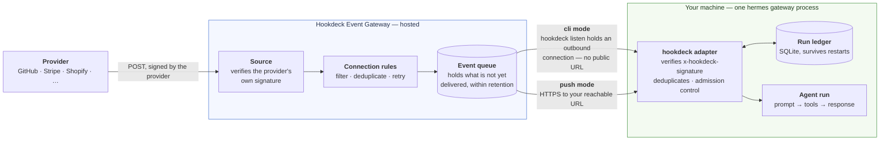
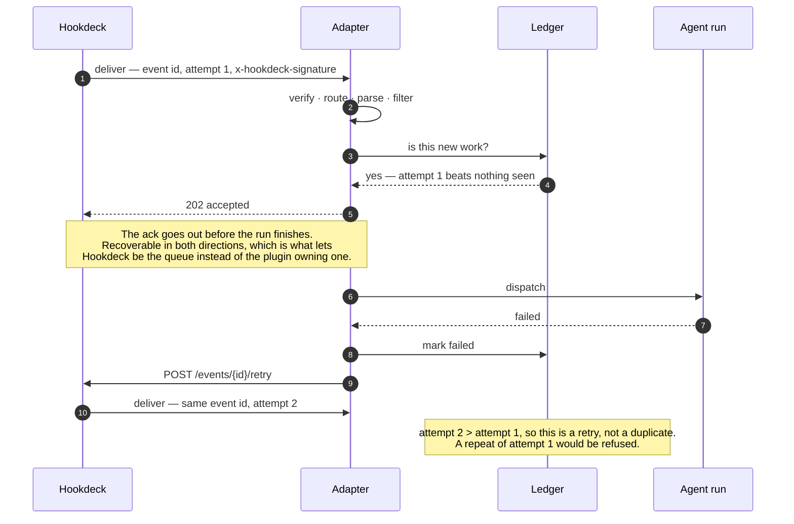

# How it fits together

Where each piece runs, and what crosses your network boundary.

Two signatures, two different jobs. Hookdeck checks the *provider's* signature
at the edge — Stripe's, Shopify's, Twilio's, ~140 schemes — then signs its own
delivery. The adapter checks only that one, which is the whole point: Hermes
implements one verifier instead of one per provider.

## The delivery that has to come back

The diagram above is only the path in. What makes this more than a webhook
listener is the arrow it does not show — the adapter telling Hookdeck a run
failed, so the event returns instead of being forgotten:

The attempt counter is what lets deduplication and retry coexist rather than
cancelling out. It is also how a gateway that dies at step 7 recovers: the
ledger row is still `running` at the next start, which by then can only be an
orphan, so the adapter asks for the same redelivery at step 9. See
[reliability](reliability.md) for the ack modes.

## Two ways in

Both modes run the same adapter and the same reliability machinery. They differ
only in how an event crosses your network boundary.

| | `mode: cli` (default) | `mode: push` |
|---|---|---|
| Reachability | None needed — the connection is outbound | A public HTTPS URL |
| Suits | A laptop, a homelab box, anything behind NAT | A VPS, a container, anything with an address |
| Extra process | One `hookdeck listen` per route | None |
| Gateway-side throttling | Not available — CLI destinations have no rate limit | Delivery rate limits, delivery groups, issue triggers, alerting |
| Buffering while you are down | Only if you **pause** first | Yes; failed deliveries stay queued and retry |

In `cli` mode the listener binds loopback only and is not reachable from the
network at all. In `push` mode it binds whatever `host` you configure, and the
signature check is the only thing in front of it.

## Three things here are called "CLI"

Worth separating once, because the quickstarts use all three:

- **The Hookdeck CLI** (`hookdeck`) — a binary you install from Hookdeck, and
  what makes `cli` mode work. You do not run it by hand: the adapter spawns
  `hookdeck listen` itself, one process per route, and supervises it —
  restarting with capped backoff if it dies, piping its output into the gateway
  log. What you do need is version 2.3.2 or later. The adapter authenticates a
  CLI session of its own; see [operations](operations.md).
- **`hermes hookdeck …`** — the operator commands this plugin adds: `setup`,
  `status`, `pause`, `resume`, `retry`, `doctor`. These call the Hookdeck REST
  API rather than the binary above, and work in both modes.
- **`hermes`** — Hermes' own CLI, which hosts all of the above. `hermes gateway`
  runs the process the adapter lives in.

## What the adapter does with one delivery

The order is deliberate, and the security-relevant part is that nothing reads
the payload before the signature is checked:

1. **Verify** `x-hookdeck-signature` against the raw bytes, in constant time.
2. **Route** — by the path segment Hookdeck was told to deliver to, else by
   source name. No match is a 404, never a guess.
3. **Parse** as strict UTF-8 JSON or form encoding. Anything else is a 400 that
   no retry can fix.
4. **Filter** — the route's `events` list, payload filters and route script. An
   event the route does not want gets a 200, not an error.
5. **Deduplicate** against the ledger, *before* considering capacity, so a
   repeat arriving at a busy moment is not deferred and then mistaken for new
   work when it comes back.
6. **Admit or defer** — over `max_concurrent`, the answer is 503 with
   `Retry-After` and nothing is written down.
7. **Dispatch**, then answer according to `ack_mode`, and record the run's real
   outcome when it finishes.

Each step either produces a response and stops, or hands the delivery on.
